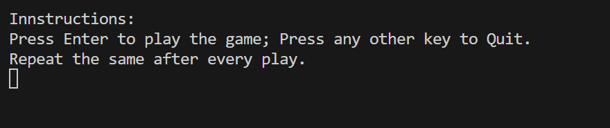
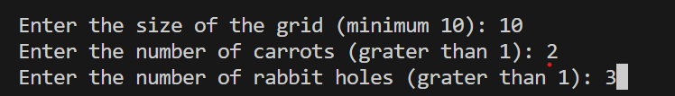

# RabbitGame
 
Design a command line game using Python that has the following requirements:
 
Game elements
- Rabbit (denoted by the character “r” and “R”)
- Carrot (denoted by the character “c”)
- Rabbit hole (denoted by the character “O”)
- Pathway stone (denoted by the character “-”)
 
Game story
​Our friendly neighbourhood rabbit, Mr. Bunny wants to gather carrots from the yard and take them back to his humble abode. He needs your help in picking up the carrots from the yard and dropping them in his rabbit hole.
 
Game design
The task includes three aspects:
1. Random map generator :-
Generate a 2D map of more than or equal to 100 characters(based on user input) such that it contains
- 1 Rabbit
- More than 1 Carrot (user input)
- More than 1 Rabbit Hole (user input)
- Rest Pathway stones
​​such that they are placed randomly every time we hit the enter key. Display this on the command line.
2. The game :-
- Build capabilities to move the rabbit (from his initial random position as generated by the random map generator) left, right, up, down or diagonally using the “a”, “d”, “w”, “s” and combination of these four keys(for diagonal movement) respectively.
- The rabbit cannot move across a carrot. He has to pick it up using the “p” key.
- Once the rabbit picks up the carrot, the character denoting the rabbit changes from “r” to “R”.
- The rabbit cannot move across a rabbit hole. He has to jump across by pressing the “j” key. If he is to the right of the hole, pressing the jump key will move him to the left of the hole, if he is above the hole pressing jump key will move him to below the hole vice versa, but not diagonally.
- Once the rabbit holds the carrot, placing it into a hole can be accomplished by positioning itself adjacent to the hole and pressing the "p" key. The game concludes as soon as any carrot is deposited into any of the holes.
- The rabbit is limited to holding just a single carrot at any given moment.
- The entire game map should run on a single grid on the command line - changing the state of the game should not spawn a new grid every time.
 
3. Solution Generator :-
- Generate a solution for the presented problem with the shortest path(minimum number of steps) the rabbit needs to follow to finish the game.
- Illustrate the solution through a step-by-step emulation on the provided grid, all without the need for any additional input.
- Below is an illustration of the solution approach within a 1D field.

# Results
<table>
  <tr>
    <td></td>
    <td></td>
    <td></td>
  </tr>
  <tr>
    <td></td>
    <td></td>
  </tr>
</table>

